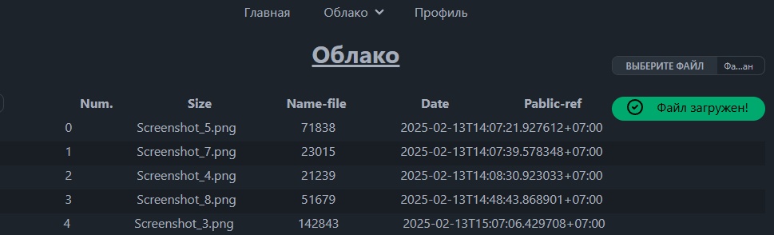
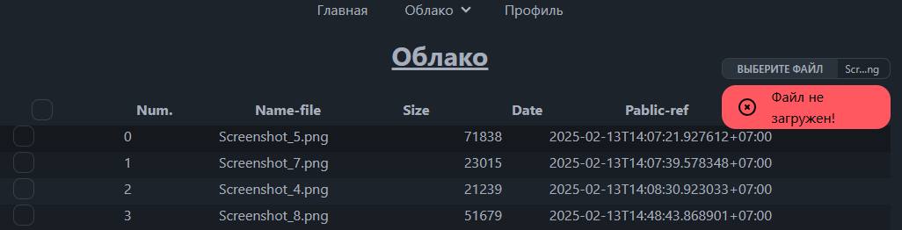
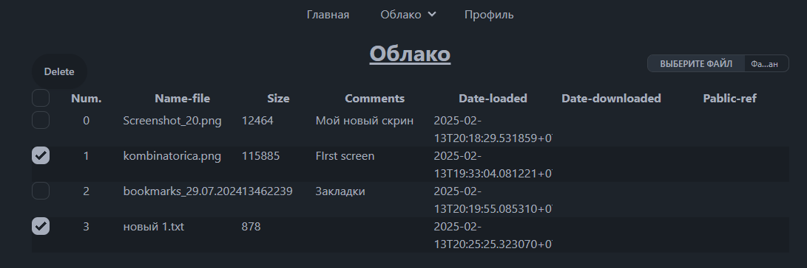
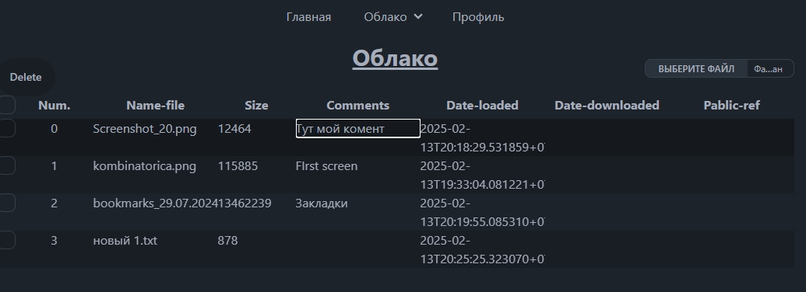
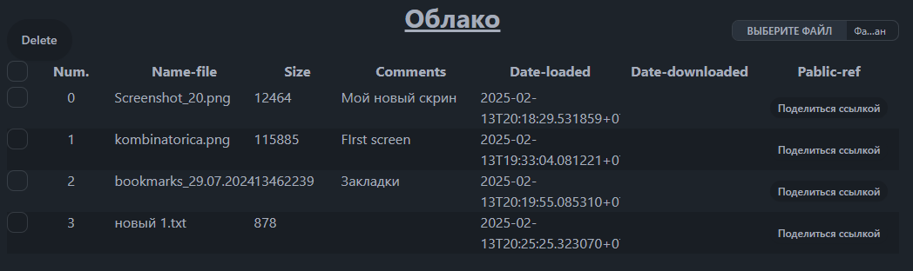
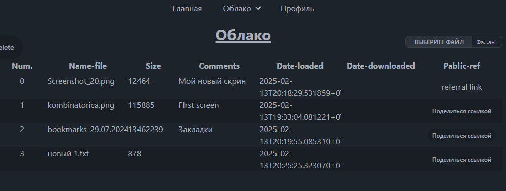
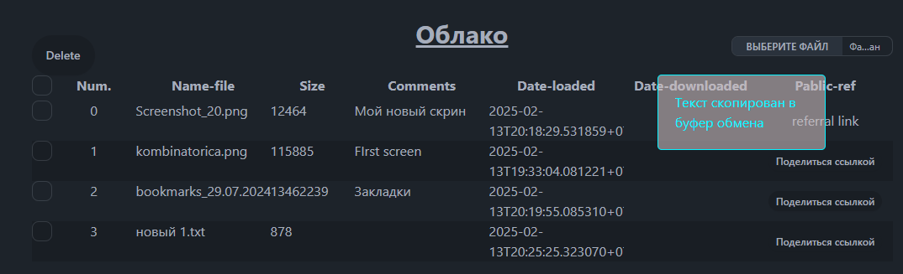
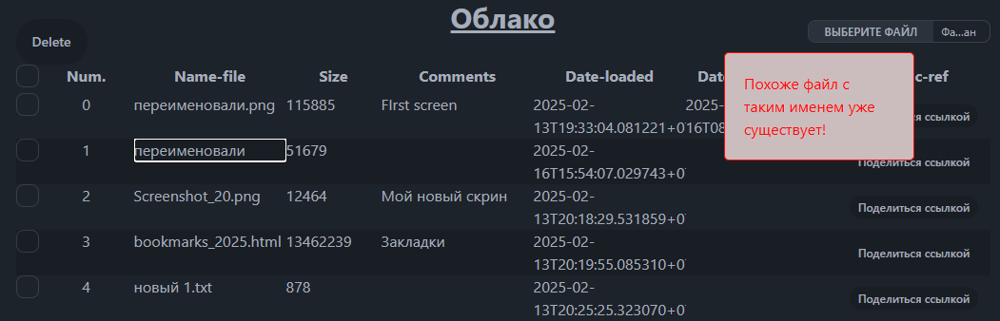

В работе.

[backend](https://github.com/Tryd0g0lik/cloud)
## Регистрация
\
Форма возвращает ошибки если данные введены не верно.

Если пользователь иметтся с таким email, то под формой видим сообщие.

При регистрации, на почту поступает ссылка. Кликая по ссылке, из сообщения, \
подтверждаете email.

После клика , срабатывает 301 код (на сервере) и пользователя пребрассывает на "Главная".\
URL дополнен паррамертрами:
- "`is_session_< user-id >`";
- "`user_session_< user-id >`";
- "`is_active`".

Данные [созраняются](src\components\NavbarTop\index.tsx) в [cookie](src\services\cookieServices.ts).\
**Note**: Изначально строка не имеет временной отметки.

### Login
На cookie ориентируемся для активаци ("`is_active`"). пользователя.\

Каждая загрузка страницы, ориентируясь на "`is_active`", запускает \
параллельно ("`Promise`") две задачи:
 - "`handlerLogin()`";
 - "`changeDOM(true)`" В "`DOM`" добавляет класс "`active`" & "`div#root.active`" или \
 удаляет "`div#root`" если  "`changeDOM(false)`";

**Note:** По умолчанию, входная точка из [changeDOM()](src\services\scripts.ts) имеет значение "`false`".

#### handlerLogin() дочерная функция.
Делает запрос в cookie и получает значение ключа "`is_session`".\
Если значение есть `true` - пользователь на сайте активирован.

Значит, по шаблону "`/user_session_< user id >/`" получаем имя ключа. Из ключа получаем \
номер `id` (под которым он есть в БД (Базе Данных)).\
"`id`" шифруем и сохраняем с клю.чем "`session`" в "`localstorage`".

- [класс для шифрования](src\services\encrypts.ts).

# Активация
 \
Два варианта авторизации. 
При авторизации на сервер, синхронно отправляется 2 запроса. Это вариант кодгда из \
прошлых посещений cookie сохранил данные пользователя. У нас есть индекс. \
На сервере по индексу получаем хеш-ключ. Сравниваем его с тем, что поступил их браузера.
1. Получаем токен.
2. Отправляем данные для авторизации.
**Note**: Если это повторная авторизация , то пользователя (*и ключ*) берем из cookie

## COOOKIE если чистый в браузере

На случай если cookie пустой (*браузер почистили*), отправляем синхронно 3 запроса.  
1. Получаем токен.
2. Берем email из формы.  [Шифруем и отправляем на сервер](src\services\request\loginout.ts) (*`AES.encrypt` `ENCRYPT`*).  
3. Отправляем данные для авторизации. Главное, у нас есть индекс. \
Там перебираем базу пользователей в поике данных по email.\
Сравниваем хеш паролей.

**Note**: 
1. База данных имеет два вида кеша. Для паролей. Для ключа польхователя.
1. Кеш каждого вида/типа/категории (*не пользователя*) имеет свой шаблон маски.
1. Для определения пользователя (*если cookie пустой*), данные берем из формы и на сервере сверяем пароли кешированные.

**Note**:
1. Для ключа пользователя, на сервере есть отдельный поток для обновления (*с интервалом в 30 минут*).
1. Отбор пользователй для обработки проходит только тех кто имеет статус - активный и от последнего времени логирования прошло 1 и более 1-ого дня.
1. Совершаея переход между страницами сревиса, cookie браузера обновляется. Вместе с ним обновляется и ключ пользователя.
1. Для активации (при совершении событий CRUD) берем ключ и сравниваем его с тем, что хранится на сервере.
1. Пользователь сам выйдет из профиля (*`logout`*) или не будет совершать ни каких событий в течение суток - в базе данных обновляется статус (*`is_Active`= `False`*) при заагрузки страницы.
1. Загружаясь (*спустя сутки*), браузер запрашивает из cookie статуc пользователя и получая `False`, попадаем на главную.

## Счётчик
 В сервис [заложен счетчик](src\services\counter.ts), чтоб отслеживать колличество ОТКРЫТЫХ/ЗАКРЫТЫХ вкладок. Только счетчик! Идея такова , чтоб при закрытии последней вкладыки с облаком, на сервер отправляется запрос и в базе данных пользователь де-активируется.\
В данный момент, пользователя держим в активированном состоянии, в не зависимости от  интервала между посещение сервиса. Деактивируем, когда пользователь сам нажмет на `logout`.

# Priofile
CRUD - выполнен частично.

После успешной авторизации:
- cookie браузера получает данные;
- пользователь редиректом попадет на страницу профиля. 

Два поля:
- `username`;
- `firstname` которые пользователь может редактировать. 

- `email` и `password` просто заложены в логику, но не отработаны.

# Files

\

Загружая файлы на сервер:
- любой формат;
- по одлному;
- создаваю копию файла и лишь переименовав файл, на сервере остаётся первично загруженный файл. Дубликат удаляется. \
Хагрузить дубликат возможно при условии когда в нем будут изменения. Файлы проходят проверку через старый hash md5;
- при удачной и не удачной загрузки , в странице облака видим сообщение.

\

## Note:
Будьте остарожные с сервером. На сервере  редактирование пароля и email не закладывалось в логику.\
В модель базы данных закладывалось лишь что это уникальные поля и на них основывается "мир". \
В ТЗ нет данных (по пароля и email) для простого пользователя. Только для администора.
 
## Облако Файлов

 

Верхнее меню только для авторизованных публикует меню выподающих ссылок "Облако".\
В раскрытом режиме видим "Мои файлы". Кликая по меню  - открывается таблица файлов пользователя. 

## Удалить файл

\

Пользователь может выбрать любое количество файлов или все разом. Нажимая на \
кнопку "Delete" удаляется. \
- выбираете один или все разом, на сервер отправляется в формате списка. \
- не зависимо от количества или размера файла, под каждый файл создается \
отдельная задача и после запускаются в отдельном потоке для удаления. Поэтому\
ответ от сервера ждать не приходится и возвращается уже обновленный.

## Коментарии к файлу

\

Загрузив  файл возможно добавитьсвой комментарий или оставить ячейку пустой.\
При желании комментарии возможно изменить. Кликаем по комментарию и в ячейке получаем поле для внесения нового  комментария. \
При нажатии на клавишу 'Enter' новый комментарий отправляется на сервер и \
в ячейка видим обновленный комментарий.

## Закгрузка файла
Дата загрузи подставляется по умолчанию на момент загрузки. \
Не редактируется.

## Поделиться ссылкой

Пользователь может поделиться ссылкой изпользуя кнопку "Поделться ссфлкой". 

Клик по "Поделться ссфлкой" сформирует "referral link".

Клик по "referral link" скопирует ссылку в буфер.
Дополнительно фидим сообщение - скопирована ссылка или нет.

Через 5 секунда сообщение пропадет.

После того как воспользовались ссылкой, для скачивания, видим дату скачивания.

## Переименовать файл

Aайл возможно переименовать.\
Кликаем по имени файла и в ячейке получаем поле для внесения нового  имени. \
При нажатии на клавишу 'Enter' новое имя отправляется на сервер и \
в ячейка видим обновленное имя файла.

- Если в базе файл с таким именем существует, всплывает сообщение об ошибке. 
- расширение файла возможно переименовать.
- файл с одинаковым именем, но с разным расшиирением всплывает сообщение - всё ОК.  
